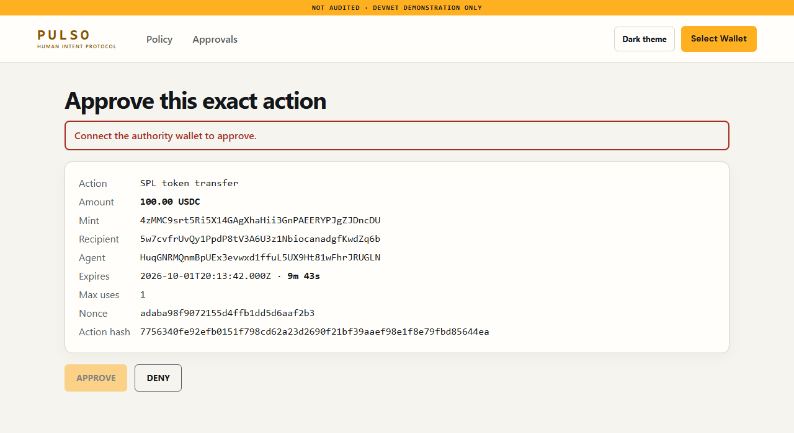

<div align="center">

<picture>
  <source media="(prefers-color-scheme: dark)" srcset="assets/readme/hero-dark.svg">
  <source media="(prefers-color-scheme: light)" srcset="assets/readme/hero-light.svg">
  
</picture>

<br>
<br>

**Programmable human authorization for AI agents on Solana.**

<br>

[](#status)
[](#status)
[](#architecture)
[](#security-notice)
[](LICENSE)

<br>

> ### The agent holds the wallet. The human holds the authority.

</div>

---

> [!CAUTION]
> ### Security notice
> **NOT AUDITED · DEVNET DEMONSTRATION ONLY.** This is prototype architecture built for a hackathon, not production custody. Do not put real funds behind it.

---

## The problem

AI agents are getting wallets. A wallet proves that software **can sign**. It does not prove that a human **wanted this transaction**.

Hand an agent an unrestricted private key and you inherit every failure mode of the model: prompt injection, a compromised tool, a reasoning error, a swapped recipient, runaway spend. Require human approval for everything and you have destroyed the reason to use an agent at all.

PULSO is the third option: **bounded autonomy**.

```yaml
payment-agent:
  autonomous:
    up_to: 10 USDC

  require_human:
    spend_above: 10 USDC
    permission_change: true

  limits:
    max_per_transaction: 500 USDC
    max_daily: 1000 USDC

  forbidden:
    - modify_own_policy
```

## The primitive

Traditional wallets answer *who holds the key?* PULSO answers *what is this entity authorized to do?*

An authorization is not "this agent may use my wallet". It binds **human authority + agent + action + asset + amount + recipient + scope + expiration + nonce + usage count** into a single hash, signed by the human and enforced on-chain.

Change the amount, change the recipient, reuse it, or let it expire — and it stops being valid.

<picture>
  <source media="(prefers-color-scheme: dark)" srcset="assets/readme/primitive-dark.svg">
  <source media="(prefers-color-scheme: light)" srcset="assets/readme/primitive-light.svg">
  
</picture>

<picture>
  <source media="(prefers-color-scheme: dark)" srcset="assets/readme/flow-dark.svg">
  <source media="(prefers-color-scheme: light)" srcset="assets/readme/flow-light.svg">
  
</picture>

The enforcement lives in the same programmable environment where the agent executes economic actions. That is the reason this is a Solana program and not a backend service: a backend can be bypassed by an agent that simply calls the chain directly.

### Approval screen



*The local approval screen shows the exact payload the wallet signs. NOT AUDITED · DEVNET DEMONSTRATION ONLY.*

## Demo scenarios

The local demo runs all scenarios A–G with test USDC and a local Solana validator. The command reports each scenario as `PASS` and stops at the first failure. Scenarios C–E restart local validators to isolate state; F sets the LiteSVM clock past the authorization expiry; G is the [authority receipt](#authority-receipt) check from the payee side.

<picture>
  <source media="(prefers-color-scheme: dark)" srcset="assets/readme/scenarios-dark.svg">
  <source media="(prefers-color-scheme: light)" srcset="assets/readme/scenarios-light.svg">
  
</picture>

| | Scenario | Expected |
|:--:|:--|:--|
| **A** | 5 USDC, under the limit | `SUCCESS` — fully autonomous, no human |
| **B** | 100 USDC, over the limit | `HUMAN_INTENT_REQUIRED` → approval → `SUCCESS` |
| **C** | Authorized 100, agent attempts 150 | `PULSO_006_INTENT_MISMATCH` |
| **D** | Authorized recipient changed | `PULSO_006_INTENT_MISMATCH` |
| **E** | Authorization reused | `PULSO_005_INTENT_ALREADY_USED` |
| **F** | Authorization past expiry | `PULSO_004_INTENT_EXPIRED` |
| **G** | Payee verifies the authority receipt | delivered after a PULSO payment; refused (`NOT_PULSO_TRANSFER`) after a direct transfer |

## Architecture

The core authorization accounts are `AgentPolicy`, `IntentAuthorization`, and `RecipientApproval`; funds are held in a program-controlled vault.

**`AgentPolicy`** — seed `["policy", human, agent]` — the standing grant: per-transaction cap, daily cap, approval thresholds, new-recipient rule.

**`IntentAuthorization`** — seed `["intent", authority, action_hash]` — one human approval of one exact action: `action_hash`, `expires_at`, `max_uses`, `used_count`, `revoked`.

`RecipientApproval` records human-approved destination token accounts. Funds sit in a **program-controlled vault**, never in a keypair the agent holds. Nothing semantic goes on-chain: pubkeys, hashes, limits, timestamps and status only — never names, documents, addresses or prompts.

The invariant everything else protects:

```
AGENT_AUTHORITY must never be able to increase AGENT_AUTHORITY
```

Only the human authority widens a policy.

See [`docs/ONCHAIN_ARCHITECTURE.md`](docs/ONCHAIN_ARCHITECTURE.md), [`docs/POLICY_AND_INTENT_SPEC.md`](docs/POLICY_AND_INTENT_SPEC.md) (PULSO-RFC-0001, an open RFC: comments welcome as issues) and [`docs/SECURITY_MODEL.md`](docs/SECURITY_MODEL.md). The receipt format is in [`docs/AUTHORITY_RECEIPT_SPEC.md`](docs/AUTHORITY_RECEIPT_SPEC.md).

## SDK

```ts
import { PulsoClient } from "@pulso/sdk";

// Supplied by setup: connection is a Connection, agentKeypair a Keypair,
// humanPublicKey and merchantTokenAccount are PublicKeys.
const client = new PulsoClient({
  connection,
  agent: agentKeypair,
  human: humanPublicKey,
});
const result = await client.execute({
  amount: 5_000_000n, // raw base units: 5 USDC at 6 decimals
  recipient: merchantTokenAccount, // PublicKey of the destination token account
});

if (result.status === "HUMAN_INTENT_REQUIRED") {
  console.log(result.approvalUrl ?? "Configure approvalsUrl to publish an approval URL");
}
```

`PulsoClient.execute` accepts `amount: bigint` and `recipient: PublicKey`; it returns `status: "executed"` or a pending human intent. `mint` is read from the policy vault, not passed to `execute`.

You built the agent. You should not have to build your own authorization system.

The SDK is part of this demonstration; it is not published to npm. Inside the repository it resolves as a workspace package.

## Quickstart

### Prerequisites

Versions below come from repository manifests and CI. The Solana CLI is not pinned by this repository; the local version used for validation was Agave/Solana CLI 4.3.0.

- Node.js 22 (CI major version).
- pnpm 12.8.1 (`package.json`).
- Rust 1.89.0 (`rust-toolchain.toml`). Install Rust with `rustup`; the pinned version is downloaded automatically on first use.
- Anchor CLI 1.2.0 (CI and Anchor dependencies).
- Solana/Agave CLI; CI installs the Anza `stable` channel.

### Run the complete local demo

```bash
git clone https://github.com/MarioMatheusPombal/pulso-solana
cd pulso-solana
bash scripts/demo.sh               # builds the program, then runs scenarios A–G
```

The script checks for `pnpm`, Anchor, Cargo, and `solana-test-validator`, installs the locked dependencies, builds the program for SBF v0, and runs A–G. Node.js 22, pnpm 12.8.1, Rust 1.89.0, Anchor CLI 1.2.0, and the Solana/Agave CLI are the versions used by the repository's CI/build setup. It creates local test accounts and a 500 USDC test vault. A transfers 5 USDC without approval. B pauses at 100 USDC, records one approval, then executes. C attempts to change the authorized amount from 100 to 150 USDC; D changes the recipient; E replays a one-use authorization; F attempts execution after expiry. G starts a minimal payee that sells fixed resources and checks the authority receipt (see [Authority receipt](#authority-receipt)).

Notes for a clean machine:

- Expect about 5 minutes from clone to the end of the demo (measured: 299 s for `demo.sh` over A–G in a clean container).
- A fresh clone prints `Program ID mismatch detected` during `anchor build` because Anchor generates a local deploy keypair. This is expected; the demo uses the program ID from the source code.
- In a Docker container, run with `--security-opt seccomp=unconfined`. `solana-test-validator` (Agave 4.x) needs io_uring, which the default seccomp profile blocks.

The complete run requires local RPC port 8899 to be free. If a validator is already answering there, the script stops before running scenarios and leaves that process intact. If a scenario fails its expected result, the command exits with an error instead of reporting success.

Auto approval is a simulation: the demo uses a generated localnet fixture key at `.demo/localnet/human.json` in the same process to represent the authority. It does not prove isolation of a real human key. The agent client only receives the authority public key. Never use a real wallet or funds in auto mode.

For wallet approval in scenario B instead of the default fixture approval, start the app with localnet RPC in one terminal:

```bash
NEXT_PUBLIC_RPC_URL=http://127.0.0.1:8899 pnpm --filter @pulso/app dev
```

Then run A/B in a second terminal (the UI approval option applies to this scenario pair):

```bash
pnpm demo -- --approve ui
```

Open the printed approval URL and connect a localnet test wallet matching the generated authority fixture. The app displays the exact payload and signs `record_intent` in that wallet. The approval transaction is signed by the connected wallet. Setup still uses local fixture keys to initialize demo accounts; this local harness does not demonstrate isolation of a real human wallet. The browser-wallet path has not been exercised by an end-to-end test.

To run one scenario instead of the full A–G sequence, pass its selector:

```bash
bash scripts/demo.sh --scenario C  # also accepts D, E, F, or G
bash scripts/demo.sh --scenario AB # runs the automatic and approval cases
```

## Authority receipt

Whoever receives a payment from an agent can check, from public chain data alone, that it left a vault governed by a PULSO policy, that the policy was defined by a key different from the agent's, and that the payment was either autonomous (inside the limit) or approved by that key for the exact action. The receipt is derived from the transaction signature and what the verifier reads on-chain; nothing extra is written to the chain.

```bash
bash scripts/demo.sh --scenario G   # or: pnpm demo -- --scenario G
```

Scenario G starts a minimal payee over HTTP. Without proof it answers `402` with a challenge (scheme `pulso-receipt-v1`); the agent pays and repeats the request with the transaction signature.

- **G1:** 5 USDC inside the limit. The agent pays through PULSO alone and the payee delivers. Receipt mode: `autonomous`.
- **G2:** 100 USDC above the limit. Human approval, then execution. The payee requires an approved receipt and sees the authorizing key and `hashVerified: true`.
- **G3:** the agent pays the same 5 USDC by a direct SPL transfer, outside PULSO. The money arrives and the delivery is refused (`NOT_PULSO_TRANSFER`): no proof of authority, no delivery.
- **G4:** the agent replays the G1 signature against a new challenge (`NONCE_MISMATCH`) and against the already redeemed one (`CHALLENGE_CONSUMED`).

The app has a read-only page for any transaction, at `/receipt/<signature>`. It signs nothing.

**What a receipt proves:** a key (`human`) different from the agent's key defined the policy and is the only one that can change it; the transfer passed the program's checks at that slot; in approved mode the same key signed a hash covering that exact recipient, mint, amount and nonce.

**What it does not prove:**

- Identity. It says "a second key defined this", not "an accountable person did". Anyone can create a policy and control both keys. A payee can accept only keys it already knows, and matching a key to an identity happens off-chain.
- That a human saw the payment in autonomous mode, or that what was bought is what the agent wanted. PULSO does not interpret purchases.
- That the signature is not copied. It is a bearer proof: whoever presents it first to the payee's challenge wins the delivery.
- That the program stays the same. You trust the code at that program ID, which is upgradeable and not audited.

This uses the HTTP 402 status with its own scheme, `pulso-receipt-v1`. It is not compatible with x402. **NOT AUDITED · DEVNET DEMONSTRATION ONLY.**

## Authorization trail

Every scenario that runs against a local validator ends by reading the policy's trail back from the chain. You can also run the reader on its own; it is read-only and never signs or sends anything:

```bash
pnpm trail -- --policy <policy-pubkey> [--rpc <url>] [--json]   # default RPC: local validator
```

```text
2026-10-02T16:08:27Z  NXXe…zcSr3  policy created  v1  max 500/tx, 1000/day, approval above 10
2026-10-02T16:08:29Z  5xBg…LFuiG  transfer autonomous  5 to 9ru6…3uWok
2026-10-02T16:08:29Z  2ff6…3T7qc  approval recorded  by human FK2J…mvEUE
    intent DH2b…eZ3P3  hash 343f…97f92  expires 2026-10-02T16:10:29Z  uses 1
2026-10-02T16:08:30Z  5m2P…dyHKz  transfer approved  100 to 9ru6…3uWok
    approved by human FK2J…mvEUE at 2026-10-02T16:08:29Z  intent DH2b…eZ3P3  used 1/1  hash verified
summary: 1 autonomous, 1 approved (1/1 hash verified), 0 refused
```

Each approval is an on-chain record of which human key authorized which exact action. Anyone can recompute the action hash from public data and compare it with the one on chain.

## Status

Built for the **Crypto World's Fair** hackathon (Colosseum × Superteam Brasil), submission 12 October 2026.

| | |
|:--|:--|
| Program ID | [`4jdHys9YsHTbVQxB6YAr7R8jsmoEy7wqcpxC9tk2dqQi`](https://explorer.solana.com/address/4jdHys9YsHTbVQxB6YAr7R8jsmoEy7wqcpxC9tk2dqQi?cluster=devnet) |
| Devnet status | Deployed on Devnet on 1 October 2026 (upgradeable; redeploy with `scripts/devnet-deploy.sh`). `bash scripts/setup-demo.sh devnet` creates the test mint, policy and vault there and is idempotent; it needs a funded Devnet wallet at `~/.config/solana/id.json`. The reproducible A–G demo runs locally. |
| What works today | `bash scripts/demo.sh` runs local scenarios A–G with test accounts. |
| Not in scope | mainnet custody, token, NFT, DAO, KYC, fiat bridge, multi-chain, recommendation or procurement |

**Public demo video:** [A–F demo capture](assets/pulso-demo.mp4) · [English captions](assets/pulso-demo.en.srt). The video is generated in CI from real local-validator runs for A–E; F is labeled as a LiteSVM simulation, not an RPC receipt. **NOT AUDITED · DEVNET DEMONSTRATION ONLY.**

## What PULSO is not

It is not an AI agent, a shopping agent, a procurement tool, a recommendation engine, an intent-detection service, a generic wallet or a token project.

**PULSO is the authorization layer an AI agent has to pass through.** Authorization, not recommendation. Enforcement, not commerce.

## Where this is going

PULSO is being built as a B2B product: human authorization for AI agents, aimed at teams that build agents and payment products on Solana. The path is a devnet sandbox, then paid pilots with hands-on integration support, then a managed service.

| | |
|:--|:--|
| **Available today** | This repository: a reproducible devnet and localnet demonstration. The Anchor program, the TypeScript SDK source in `sdk/`, the agent demo (scenarios A–G) and the approval app. |
| **Integration interfaces** | The on-chain program and its IDL, the [policy and intent spec](docs/POLICY_AND_INTENT_SPEC.md), and the SDK source. The SDK is not published to a package registry, and there is no MCP server. |
| **Planned, not available** | A managed commercial service. It is not offered, has no date, and no billing, mainnet, custody, multi-approver or SLA exists. |

If you build agents or payments on Solana and want to try PULSO in a devnet pilot or as a design partner, open an issue in this repository.

## License

[Apache-2.0](LICENSE). The license covers the code of this published demonstration in this repository. The planned managed service is a separate commercial product and is not part of this repository.

<div align="center">
<br>

<picture>
  <source media="(prefers-color-scheme: dark)" srcset="assets/readme/footer-dark.svg">
  <source media="(prefers-color-scheme: light)" srcset="assets/readme/footer-light.svg">
  
</picture>

</div>
