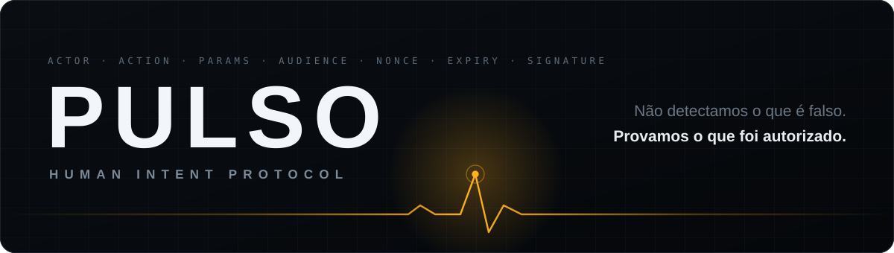
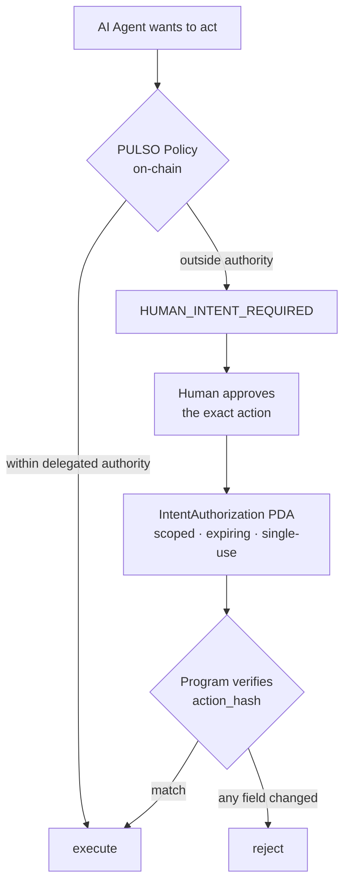

<div align="center">

<picture>
  <source media="(prefers-color-scheme: dark)" srcset="assets/banner-dark.svg">
  <source media="(prefers-color-scheme: light)" srcset="assets/banner-light.svg">
  
</picture>

<br>
<br>

**Programmable human authorization for AI agents on Solana.**

<br>

[](#status)
[](#status)
[](#architecture)
[](#security-notice)
[](LICENSE)

<br>

> ### The agent holds the wallet. The human holds the authority.

</div>

---

> [!CAUTION]
> ### Security notice
> **NOT AUDITED · DEVNET DEMONSTRATION ONLY.** This is prototype architecture built for a hackathon, not production custody. Do not put real funds behind it.

---

## The problem

AI agents are getting wallets. A wallet proves that software **can sign**. It does not prove that a human **wanted this transaction**.

Hand an agent an unrestricted private key and you inherit every failure mode of the model: prompt injection, a compromised tool, a reasoning error, a swapped recipient, runaway spend. Require human approval for everything and you have destroyed the reason to use an agent at all.

PULSO is the third option: **bounded autonomy**.

```yaml
shopping-agent:
  autonomous:
    max_per_transaction: 25 USDC
    max_daily: 100 USDC
    recipients: [verified_merchants]

  require_human:
    spend_above: 25 USDC
    new_recipient: true
    permission_change: true

  forbidden:
    - transfer_wallet_ownership
    - modify_own_policy
```

## The primitive

Traditional wallets answer *who holds the key?* PULSO answers *what is this entity authorized to do?*

An authorization is not "this agent may use my wallet". It binds **human authority + agent + action + asset + amount + recipient + scope + expiration + nonce + usage count** into a single hash, signed by the human and enforced on-chain.

Change the amount, change the recipient, reuse it, or let it expire — and it stops being valid.



The enforcement lives in the same programmable environment where the agent executes economic actions. That is the reason this is a Solana program and not a backend service: a backend can be bypassed by an agent that simply calls the chain directly.

## Demo scenarios

The demo is the test suite. Every row below is reproducible.

| | Scenario | Expected |
|:--:|:--|:--|
| **A** | 5 USDC, under the limit | `SUCCESS` — fully autonomous, no human |
| **B** | 100 USDC, over the limit | `HUMAN_INTENT_REQUIRED` → approval → `SUCCESS` |
| **C** | Authorized 100, agent attempts 150 | `PULSO_006_INTENT_MISMATCH` |
| **D** | Authorized recipient changed | `PULSO_006_INTENT_MISMATCH` |
| **E** | Authorization reused | `PULSO_005_INTENT_ALREADY_USED` |
| **F** | Authorization past expiry | `PULSO_004_INTENT_EXPIRED` |

## Architecture

Two PDAs carry the whole model.

**`AgentPolicy`** — seed `["policy", human, agent]` — the standing grant: per-transaction cap, daily cap, approval thresholds, new-recipient rule.

**`IntentAuthorization`** — seed `["intent", authority, intent_hash]` — one human approval of one exact action: `action_hash`, `expires_at`, `max_uses`, `used_count`, `revoked`.

Funds sit in a **program-controlled vault**, never in a keypair the agent holds. Nothing semantic goes on-chain: pubkeys, hashes, limits, timestamps and status only — never names, documents, addresses or prompts.

The invariant everything else protects:

```
AGENT_AUTHORITY must never be able to increase AGENT_AUTHORITY
```

Only the human authority widens a policy.

See [`docs/ONCHAIN_ARCHITECTURE.md`](docs/ONCHAIN_ARCHITECTURE.md), [`docs/POLICY_AND_INTENT_SPEC.md`](docs/POLICY_AND_INTENT_SPEC.md) and [`docs/SECURITY_MODEL.md`](docs/SECURITY_MODEL.md).

## SDK

```ts
const result = await pulso.execute({
  type: "transfer",
  mint: USDC,
  amount: 250,
  recipient: merchant
})

if (result.status === "HUMAN_INTENT_REQUIRED") {
  console.log(result.approvalUrl)
}
```

You built the agent. You should not have to build your own authorization system.

## Quickstart

> [!NOTE]
> The program, SDK and app land in this repository as they are released from the working repo. Until the first release, this section is the target shape, not a description of what is already here. Track progress under [Releases](../../releases).

```bash
git clone https://github.com/MarioMatheusPombal/pulso-solana
cd pulso-solana
pnpm install
anchor build && anchor test        # runs scenarios A–F
./scripts/demo.sh                  # end-to-end demo against devnet
```

## Status

Built for the **Crypto World's Fair** hackathon (Colosseum × Superteam Brasil), submission 12 October 2026.

| | |
|:--|:--|
| Program | Anchor · devnet · program ID published on first release |
| What works today | repository scaffolding; see Releases for shipped components |
| Not in scope | mainnet custody, token, NFT, DAO, KYC, fiat bridge, multi-chain, recommendation or procurement |

## What PULSO is not

It is not an AI agent, a shopping agent, a procurement tool, a recommendation engine, an intent-detection service, a generic wallet or a token project.

**PULSO is the authorization layer an AI agent has to pass through.** Authorization, not recommendation. Enforcement, not commerce.

## License

[Apache-2.0](LICENSE).

<div align="center">
<br>
<sub>

**Give agents money without giving them unlimited power.**

</sub>
</div>
