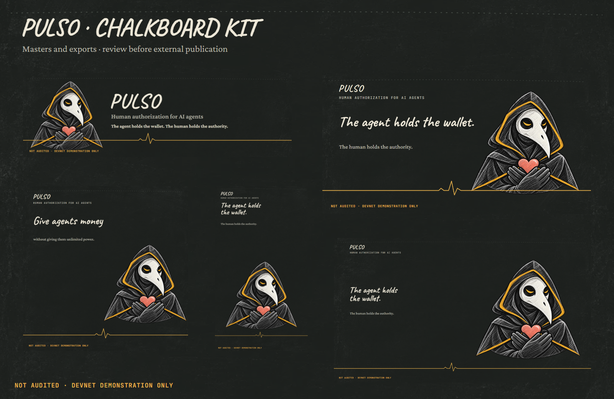

# PULSO · chalkboard identity v1

Single source of the approved visual identity: dark slate, ivory chalk, attention amber and coral heart. The expressive Guardian stays recognizable; no composition in this kit is evidence of authorization.

**NOT AUDITED · DEVNET DEMONSTRATION ONLY**



## Quick use

| Surface | Editable master | Ready export | Size / safe zone |
|---|---|---|---|
| Horizontal mark | [`brand/guardian-horizontal.svg`](brand/guardian-horizontal.svg) | [`brand/guardian-horizontal.png`](brand/guardian-horizontal.png) | 1600×500; 6% on the sides |
| Avatar | [`brand/guardian-avatar.svg`](brand/guardian-avatar.svg) | [`brand/guardian-avatar.png`](brand/guardian-avatar.png) | 512×512; inner circle of 456 px |
| Favicon / app mark | [`brand/favicon.svg`](brand/favicon.svg) | [`brand/favicon.ico`](brand/favicon.ico) and PNG/SVG at 16, 32, 48, 64, 180, 192 and 512 px | inner safe area of 4% |
| GitHub / Open Graph | [`social/social-preview.svg`](social/social-preview.svg) | [`social/social-preview.png`](social/social-preview.png) | 1200×630; text in the central 60% |
| Banner | [`social/banner.svg`](social/banner.svg) | [`social/banner.png`](social/banner.png) | 1500×500; 6% on the sides |
| Square post | [`social/square.svg`](social/square.svg) | [`social/square.png`](social/square.png) | 1080×1080; 7% on each side |
| Story / reel cover | [`social/story.svg`](social/story.svg) | [`social/story.png`](social/story.png) | 1080×1920; text between 145 and 1500 px |
| Pitch 16:9 | [`pitch/cover.svg`](pitch/cover.svg) | [`pitch/cover.png`](pitch/cover.png) | 1920×1080; 6% on the sides |
| Pitch divider | [`pitch/section-divider.svg`](pitch/section-divider.svg) | [`pitch/section-divider.png`](pitch/section-divider.png) | 1920×420 |
| README | [`readme/hero.svg`](readme/hero.svg) | [`readme/hero.png`](readme/hero.png) | 1200×400 |
| Docs / packages | [`readme/docbar.svg`](readme/docbar.svg) | [`readme/docbar.png`](readme/docbar.png) | 1200×96 |
| Technical diagrams | [`readme/flow.svg`](readme/flow.svg), [`primitive.svg`](readme/primitive.svg), [`scenarios.svg`](readme/scenarios.svg) | PNGs in `readme/` | technical text preserved |

## Visual rules

- The background is always slate/charcoal. A subtle texture stays behind the content; it never reduces the contrast of a payload or technical text.
- Caveat is for brand, titles and short annotations. Crimson Pro is for reading. JetBrains Mono is for hashes, pubkeys, states and the notice.
- In the app, the base is the modern Humanist layer (Nunito/Nunito Sans) and Caveat appears only as an accent in margin notes. The app tokens are in `app/app/globals.css`.
- Amber means attention or a pending human decision, never success. Green appears only after a confirmed result. Coral is editorial.
- Preserve the Guardian's face, eyes, beak, silhouette, hands and heart. Do not redraw it as a geometric icon.
- Every public composition includes `NOT AUDITED · DEVNET DEMONSTRATION ONLY`. Small symbols depend on the notice in the context that presents them.
- Do not alter, animate or summarize payloads. Social and pitch cards use only theses and implemented capabilities.
- Motion must be subtle and have a static poster. Interfaces respect `prefers-reduced-motion`.

## Masters, origin and licenses

- `masters/guardian-chalk.webp` and `masters/slate-texture.webp` are versioned copies of the approved masters in `app/public/assets/chalk-v1/`.
- `masters/*.svg` reuses the approved authority strokes from the app.
- `fonts/` holds Caveat, Crimson Pro and JetBrains Mono with the matching SIL Open Font License files.
- Prompts and transformations of the rasters are in [`masters/image-prompts.md`](masters/image-prompts.md), copied from the app source so they travel with the kit. No new raster was generated for this kit.
- The SVGs are editable layout masters with local fonts and images. Use the PNGs in embeds, including on GitHub: SVGs loaded as an image cannot fetch those external resources. The illustration remains raster.

## README motion (#366–#369)

`motion/hero.svg`, `flow.svg`, `primitive.svg` and `scenarios.svg` are the animated versions of the diagrams in `readme/`, generated by `motion/build.py` from those same SVGs. Boxes and labels do not move; only the flow, strokes and results animate:

- **hero** (10 s loop): `PULSO` written in chalk, phrases rise, the Guardian enters, the pulse line draws, the beat passes twice and everything fades out to restart.
- **flow** (10 s loop): the action leaves the agent, passes through PULSO and runs the three paths in order. Each result lights up when the action arrives; on the middle path it stops at human approval.
- **primitive** (10 s): each field lights up and converges on the `action_hash`, the human signs, the program enforces. Then the `recipient` changes, and the hash, field and final phrase turn coral until it reverts.
- **scenarios** (10 s): A–F draw in sequence, with the result and the exact error code of each.

The SVGs are self-contained for GitHub, with WOFF2 subset fonts and downsized images, all embedded. With `prefers-reduced-motion`, each becomes the static poster identical to the PNG, and the READMEs use `<picture>` to fall back to the PNG. To regenerate: `pip install fonttools brotli pillow` and `python public/assets/chalk-v1/motion/build.py`.

## Reproduction

The build tooling is written for the source layout, where this kit lives under `public/assets/chalk-v1/` (it is published at `assets/chalk-v1/`). From the root of that source tree:

```bash
node public/assets/chalk-v1/build.js --raster
node public/assets/chalk-v1/validate.js
```

Without `--raster`, the script rebuilds the SVGs, copies masters/fonts and updates `inventory.json`. With `--raster`, headless Chrome or Edge exports PNGs at the declared sizes. The build never deletes or overwrites `brand-v1/`, `motion-v1/` or `assets/readme/`; those directories stay as history.

The full inventory, with origin, status, replacement, bytes and SHA-256, is in [`inventory.json`](inventory.json). A grouped reading is in [`ASSET_INVENTORY.md`](ASSET_INVENTORY.md).
