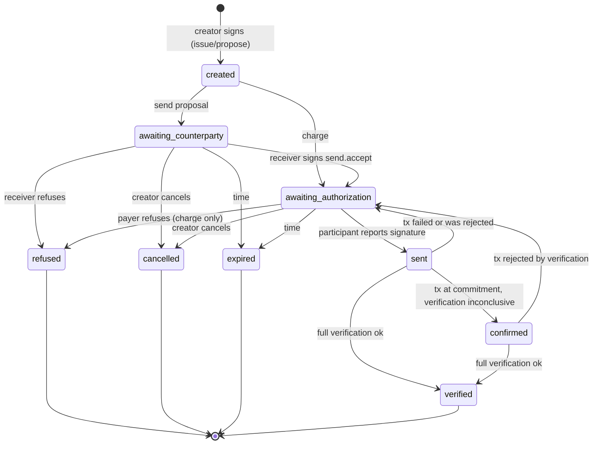

# PULSO B2B authority network v1

> **NOT AUDITED · DEVNET DEMONSTRATION ONLY**
>
> Status: technical specification of the implemented B2B network (devnet/localnet demonstration). It describes `app/lib/network-*`, `sdk/src/b2b-terms.ts` and `agent-demo/src/b2b*.ts`. No change to `programs/` was needed. Companion docs: [POLICY_AND_INTENT_SPEC.md](POLICY_AND_INTENT_SPEC.md), [AUTHORITY_RECEIPT_SPEC.md](AUTHORITY_RECEIPT_SPEC.md), [B2B_DEMO.md](B2B_DEMO.md).

## 1. What it is

Two companies, each with a human authority, recognize each other in the application, agree on an exact payment request, and the payment leaves from an agent running under a PULSO policy. The counterparty verifies the receipt against the request.

Flow: connect companies, agree on an exact request, policy/authorize, agent pays, counterparty verifies the receipt.

PULSO is not an AI agent. It is the authorization layer an agent passes through. The network only carries the request to that layer. It does not choose, recommend or interpret anything.

### Core separation

| Layer | What it proves | Where it lives | Authorizes spending? |
|---|---|---|---|
| Session (sign-in) | The wallet controls the authority right now | Backend | **No** |
| Connection | Two organizations recognized each other | Backend | **No** |
| Commercial consent | The authority signed the exact terms of a request | Backend | **No** |
| Request status | Application state | Backend | **No** |
| Policy + `record_intent` + `execute_transfer` | The human authorized that action, and the program enforced it | **Chain** | **Yes, the only layer** |

A wallet message signature is never a transaction and spends nothing. `record_intent` remains the only spending authorization above the policy's autonomous limit. Within that limit, the policy applies. Nothing in this spec changes that.

### Project rules this spec preserves

| Rule | How it holds here |
|---|---|
| The human's key stays on the device | Sign-in and consents are `signMessage` on the client. No endpoint receives a private key. |
| Enforcement in the program | Connection, status and message signature do not release spending. What refuses improper spending is `execute_transfer`. |
| The agent does not widen authority | The agent has no session, is not an organization admin and reassigns nothing. |
| Scoped, expiring, use-counted authorization | Consent is bound to a digest, has a nonce and an expiry. The spending authorization remains the intent. |
| Nothing semantic on-chain | Handle, name, connections, requests and descriptions stay off-chain. On-chain there are only pubkeys, hashes, limits and timestamps, as before. |
| The UI shows the exact payload | Every message signature shows the exact text. The digest and the terms fields appear side by side. |
| Notice on every public artifact | This spec, the UI and every receipt carry `NOT AUDITED · DEVNET DEMONSTRATION ONLY`. |

### Out of scope (deliberately)

Feed, marketplace, matching, KYC, chat, billing, mainnet, escrow, multi-approver, on-chain bilateral veto, verified-company badge, legal-identity claims.

## 2. Data model

Everything is application state (JSON files, section 9). None of it goes to the chain.

### Organization

| Field | Rule |
|---|---|
| `id` | 16 random bytes, hex |
| `handle` | section 3; unique; immutable in the demo |
| `displayName` | self-declared, 1 to 64 characters; no control characters or bidi controls (U+202A–202E, U+2066–2069); always rendered as plain text |
| `authority` | human pubkey, base58; **one per organization, and one organization per authority**; immutable in the demo |
| `receivingAccount` | receiving token account (SPL, legacy Token program), validated (below). One per organization; changing it creates a new version and keeps the previous one in `receivingAccountHistory` |
| `payerAgent` | optional: pubkey of the paying agent. Policy = PDA `["policy", authority, agent]` (`findPolicyPda`, as the SDK does), vault = `["vault", policy]` |
| `createdAt`, `rev` | ISO 8601 UTC; revision counter for compare-and-set |

**Receiving account validation**, read from the chain (`getAccountInfo`; an RPC failure refuses): the account owner is the legacy Token program `TokenkegQfeZyiNwAJbNbGKPFXCWuBvf9Ss623VQ5DA`, 165 bytes, initialized state, `mint` read from the data, `owner` read from the data and **equal to the organization's authority**. Store `{tokenAccount, mint, owner, checkedAt}`. Limit: the owner of a token account can change with `SetAuthority`. The validation is a point in time. That is why the digest binds the token account and the receipt is checked again at reconciliation (section 8). Owners that are not the authority (multisig, PDA) are not supported in the demo.

**Real level of proof**, what the UI says about an organization: "wallet X signed a PULSO challenge on <date>" and "token account Y has owner X and mint M according to the chain". Nothing more. Name and handle are self-declared. There is no verified-company badge.

### Connection

Between two organizations A (inviter) and B (invitee). At most one `pending` or `active` connection per unordered pair. Persisted states (the wire tokens are the Portuguese strings of the implementation):

| Persisted | Seen by A | Seen by B |
|---|---|---|
| `pendente` (pending) | sent | received |
| `ativa` (active) | accepted (connected) | accepted (connected) |
| `recusada` (declined) | declined | declined |
| `cancelada` (cancelled) | cancelled | (disappears from the list) |
| `expirada` (expired) | expired | expired |
| `desconectada` (disconnected) | disconnected | disconnected |

An invite is valid for 7 days. A connection stores: the two recognized authorities, each side's `receivingAccount` and `payerAgent` **at the moment of acceptance** (informational), and the consent evidence (signed messages, section 4).

| From | To | Who | How |
|---|---|---|---|
| (nothing) | pending | A | Signed message `network.connect.invite`. The target is an existing organization, found by handle or by authority. A link/code only points to the connection id. |
| pending | active | B | Signed message `network.connect.accept`. The session must belong to the invite's target authority. |
| pending | declined | B | Session + Origin. No signature (it only reduces trust). |
| pending | cancelled | A | Same. |
| pending | expired | system | Lazy: evaluated on read and on write. |
| active | disconnected | A or B | Session + Origin. Requests between the two with no payment sent yet become cancelled (reason `disconnect`); requests `sent`/`confirmed` keep being reconciled. |

Rules: self-connection is rejected; a duplicate invite or a crossed invite (B invites A while A's invite is pending) is rejected with 409 pointing to the existing one; reconnecting after disconnected/declined is a new invite (new id). Race between accept and decline: compare-and-set under lock, the first wins, the second gets 409 with the current state. Repeating an action already applied is idempotent (200, same state). A link or code grants no connection, ownership or spending.

Changing `receivingAccount` or `payerAgent` does not invalidate the connection, but the UI shows "changed since connection" and no request inherits the old or new value without consent: the destination of each request is in the snapshot, which the receiver signs (section 5). An organization's authority does not change in the demo. Changing authority means creating another organization with another handle.

### Request

Two forms, same state machine (section 6):

| Form | Who creates | Receiver's consent | Payer's consent (application) |
|---|---|---|---|
| **Charge** | Receiver R | At issue: `network.charge.issue` | None. The payer answers by paying or declining. Authorizing spending is the policy/intent. |
| **Send proposal** | Payer P | Before the payment path appears: `network.send.accept` | At creation: `network.send.propose` (an application commitment, not spending) |

Fields of a request: `id` (= nonce in hex, 32 characters), `kind` (`charge` | `send`), `snapshot` (immutable, section 5), `digest`, `status`, `rev`, `evidence`, `attempts`, `late`, `description` (optional, private, up to 280 characters, never interpreted, never on-chain nor in the receipt), `createdBy`, `createdAt`, transition history `{from, to, actor, at}`.

## 3. @handle, discovery and impersonation

**Normalization**, in this order: (1) `trim`; (2) remove **one** leading `@`; (3) if any character has a code above 0x7F, **reject** (no Unicode folding: this eliminates homoglyphs from other alphabets); (4) ASCII lowercase; (5) validate `^[a-z0-9_]{3,32}$`.

**Uniqueness** over the normalized form, case-insensitive. Immutable in the demo. **Reserved:** `pulso`, `admin`, `support`, `official`, `system`.

**Impersonation.** A handle is self-declared: first come, first served. This has no technical solution in the demo: ASCII lookalikes (`l`/`1`, `o`/`0`, `rn`/`m`) and similar names. Mandatory UI mitigation:

- The authority's full key **always** appears next to the handle and the name (copyable).
- The invite shows the full key before confirming.
- The request shows the counterparty's key and the receiving account.
- A similar name never hides a distinct wallet.

**Search.** Exact match only: handle (normalized) or public key. An invalid key and a nonexistent handle have distinct, clear errors (`INVALID_PUBKEY`, `NOT_FOUND`). No prefix, no list, no autocomplete. Requires a session (anti-enumeration; a simple per-session limit, for example 30 searches per minute, in memory). **Minimal public result:** `handle`, `displayName`, `authority`. No relation, request, history, receiving account or agent.

A transaction hash identifies a payment, not a company. It never goes in the identity field.

## 4. Session and signed messages

### Envelope

UTF-8 text, lines separated by `\n`, no trailing newline. The server builds the message and stores the challenge record. The client signs the **exact bytes** with `signMessage`. The server verifies Ed25519 over the message **it** issued, rebuilt from the record (never from the request body). The UI shows the exact text before signing.

**Sign-in** (`network.login`):

```
PULSO network sign-in
NOT A TRANSACTION · grants no spending authority
domain: <request host>
action: network.login
authority: <base58 pubkey>
cluster: <base58 genesis hash>
nonce: <32 random bytes, base64url>
issued: <ISO 8601 UTC>
expires: <ISO 8601 UTC, issued + 5 min>
```

**Commercial consent**, the same envelope with the title `PULSO network consent` and a `terms:` line after `cluster:`:

```
PULSO network consent
NOT A TRANSACTION · grants no spending authority
domain: <request host>
action: <action>
authority: <base58 pubkey of the signer>
cluster: <base58 genesis hash>
terms: <see below>
nonce: <32 random bytes, base64url>
issued: <ISO 8601 UTC>
expires: <ISO 8601 UTC, issued + 5 min>
```

| `action` | Who signs | `terms:` |
|---|---|---|
| `network.connect.invite` | inviter A | `pulso-connection-v1:<authority A>:<authority B>:<connection id>` |
| `network.connect.accept` | invitee B | same, identical string |
| `network.charge.issue` | receiver R | hex digest (64) of the charge snapshot |
| `network.send.propose` | payer P | hex digest of the proposal snapshot |
| `network.send.accept` | receiver R | the same digest as the proposal |

Decline, cancel and disconnect do **not** ask for a signature: they require session + Origin and only reduce trust or commitment. The message `nonce:` (32 bytes, the server's challenge namespace) is a **different** nonce from the request's (16 bytes, section 5).

Every line must exist, in order, exactly once. The server refuses anything that does not match the record bit for bit. Signatures travel as base64 and are stored next to the exact message (`evidence`).

### Verification and consumption (atomic, once)

1. Look up the record by nonce. Absent: `CHALLENGE_UNKNOWN`.
2. **Consume on the first attempt**, valid or not, under lock: mark `consumed` before verifying. Already consumed: `CHALLENGE_CONSUMED`. An invalid attempt burns the challenge; the client asks for another.
3. `now > expires`: `CHALLENGE_EXPIRED`.
4. The `Origin` header, when present, has the same host as `domain`; `domain` is the request host. Otherwise `DOMAIN_MISMATCH`. Behind a proxy, `Host` must arrive intact.
5. `cluster` equals the genesis hash of the configured RPC (read once with `getGenesisHash` and stored). Otherwise `CLUSTER_MISMATCH`.
6. Ed25519 over the bytes of the issued message, by the **record's** `authority` key. Otherwise `BAD_SIGNATURE`.
7. The server never trusts an `authority` coming from the body.

These codes describe the checks, not the HTTP response: a verification failure returns a generic 401 (`sign-in failed`) without distinguishing among them. Malformed input returns 400 and does not consume the nonce. `Origin` is mandatory on every `POST`.

### Session

An opaque token of 32 random bytes. Cookie `pulso_network_session`: `httpOnly`, `SameSite=Strict`, `Secure` in production, valid for 8 h. The server stores only the SHA-256 of the token. Logout deletes the record. Mutating endpoints require a session **and** an `Origin` equal to the host. A session inherits nothing from another authority. A session stops being valid if the server RPC's genesis hash changes.

The first sign-in with an authority that has no organization only allows creating the organization. The organization-authority link is born from the sign-in proof. There is no path for an agent to take over administration or reassociate an organization.

## 5. Snapshot and digest `pulso-b2b-terms-v1`

An immutable snapshot, created by whoever opens the request. The cluster is identified by its **genesis hash** (not by name).

| Field | Note |
|---|---|
| kind | charge \| send proposal |
| `genesis` | genesis hash of the cluster |
| `programId` | PULSO program |
| `policy` | PDA `["policy", payerAuthority, agent]` |
| `payerAuthority` | authority of the paying organization (`policy.human`) |
| `agent` | declared paying agent of the paying organization (`policy.agent`) |
| `mint` | mint of the receiving account; must be the mint of the policy's vault (the program requires `recipient.mint == vault.mint`) |
| `recipientTokenAccount` | destination token account, the same one that goes into `execute_transfer` |
| `receiverAuthority` | authority of the receiving organization |
| `amount` | positive integer in base units, u64 (`< 2^64`) |
| `nonce` | 16 bytes, generated by the server; unique across all requests |
| `expiry` | Unix seconds, i64; in the future, at most 30 days |

The snapshot nonce is the **same** one that goes into `execute_transfer(amount, nonce)`: 16 bytes (`ExecuteParams.nonce` in `sdk/src/client.ts`; `generateNonce()` in `sdk/src/intent.ts`; [AUTHORITY_RECEIPT_SPEC.md](AUTHORITY_RECEIPT_SPEC.md)). On the approved branch it enters the action hash.

### Digest layout (307 bytes)

SHA-256 of the concatenation, in this order, no separator, no length prefix, in the style of action hash v1 (`programs/pulso/src/action_hash.rs`):

| Field | Bytes | Encoding |
|---|---|---|
| tag | 18 | ASCII `PULSO_B2B_TERMS_V1` |
| kind | 1 | `1` = charge, `2` = send proposal |
| genesis | 32 | raw hash bytes |
| programId | 32 | raw pubkey |
| policy | 32 | raw pubkey |
| payerAuthority | 32 | raw pubkey |
| agent | 32 | raw pubkey |
| mint | 32 | raw pubkey |
| recipientTokenAccount | 32 | raw pubkey |
| receiverAuthority | 32 | raw pubkey |
| amount | 8 | u64 little-endian |
| nonce | 16 | raw bytes |
| expiry | 8 | i64 little-endian |

Total: 307 bytes. The tag differs from `PULSO_INTENT_V1` (15 bytes, 216-byte preimage) already at the seventh byte and in length: a terms digest never coincides with an action hash. The digest is not the action hash: the action hash also binds the intent's `max_uses` and `expires_at` and is computed at execution time. The two share authority, agent, mint, amount, recipient and nonce. The request UI shows both.

**Shared vectors:** `tests/vectors/b2b_terms.json`, inputs (fields in base58/decimal/hex) and output (`preimageHex`, `digestHex`), in the format of `tests/vectors/action_hash.json`: at least one case per kind, `amount` at the limit (`2^64-1`), a typical `expiry`, and a case where changing any field changes the digest. The SDK test reads the same file.

**Where the code lives.** `computeTermsDigest` lives in `sdk/src/b2b-terms.ts`, because `app/` and `agent-demo/` consume it. The SDK only gained a new pure function; no existing signature changed.

### Integrity rules

- Any edit (amount, destination, mint, deadline, agent, terms description) is a **new snapshot, new nonce, new consent**. The old request becomes `cancelado` (reason `edited`, `supersededBy: <new id>`).
- A snapshot is never rewritten. The server recomputes the digest on every critical read and compares it with the stored one.
- Creating the request requires: an `active` connection; a declared `payerAgent` on the paying organization; the policy exists on-chain (owner = `programId`, `AgentPolicy` discriminator) and a vault with the same `mint`; a valid receiving account (section 2). An unavailable RPC refuses creation. This is convenience; the one that enforces is the program.
- The private description stays outside the digest, the chain and the receipt.

### Two-call creation flow

(1) `prepare`: the server validates, generates the nonce, computes the digest, issues the consent challenge. (2) the client signs and submits; the server verifies (section 4) and writes request and evidence in a single write.

## 6. Request states

Wire tokens (Portuguese strings in the implementation; the English reading is given for the docs): `aguardando contraparte` (awaiting counterparty), `aguardando autorização` (awaiting authorization), `enviado` (sent), `confirmado` (confirmed), `verificado` (verified), `recusado` (refused), `expirado` (expired), `cancelado` (cancelled); plus a **late payment** mark. `created` exists only in the history. The receipt modes are `autônomo` (autonomous) and `aprovado` (approved).

Meaning (precise, so the UI does not promise what does not exist):

| State | Means |
|---|---|
| created | Snapshot and the creator's consent stored. Appears only in the history; the current state moves straight to the next one in the same write. |
| awaiting counterparty | Send proposal waiting for the receiver's accept. The payment path is **not** shown. |
| awaiting authorization | Terms agreed. The payment path is shown. The agent may execute; if the policy requires it, the paying human's intent is still missing (on-chain, outside the request). |
| sent | A transaction signature was reported; no verdict yet. Never green. |
| confirmed | The transaction exists at the configured commitment and succeeded; full verification has not concluded (RPC unavailable). Not green. |
| verified | Full verification against the snapshot passed (section 8). The only green state. |
| refused | The counterparty refused. |
| expired | `now > expiry` before any payment was sent. |
| cancelled | The creator cancelled, or edit, or disconnect. |

**Honesty.** Commercial status does not prevent a transfer. Cancelling, expiring or refusing a request does **not** revoke an on-chain intent, does **not** change the policy and does **not** prevent a direct SPL transfer or an agent's `execute_transfer`. If the payment happens afterwards, PULSO records and shows the fact.

### Diagram



Going back from `sent`/`confirmed` to `awaiting authorization` happens when the transaction failed (`TX_FAILED`) or does not match the snapshot. The attempt stays in `attempts` with the reason. If `now > expiry`, it goes to `expired` instead.

### Transition table and actors

| # | From | To | Who can trigger | Condition |
|---|---|---|---|---|
| 1 | (nothing) | created | **Charge**: receiver. **Proposal**: payer. | `active` connection; valid creator signature over the digest; section 5. |
| 2 | created | awaiting counterparty | system (same write) | Send proposal. |
| 3 | created | awaiting authorization | system (same write) | Charge (the receiver's consent already exists). |
| 4 | awaiting counterparty | awaiting authorization | receiver | `network.send.accept` signature over the **same** digest. |
| 5 | awaiting counterparty | refused | receiver | Session. |
| 6 | awaiting authorization | refused | payer | Charge only. Session. |
| 7 | awaiting counterparty, awaiting authorization | cancelled | creator | Session. An edit uses this transition. |
| 8 | awaiting counterparty, awaiting authorization | expired | system | `now > expiry`; evaluated on read and on write. |
| 9 | awaiting authorization | sent | payer or receiver | 64-byte base58 signature not yet bound to another request; request not expired. |
| 10 | sent | confirmed | system (at a participant's request) | Section 8, step A ok, step B inconclusive. |
| 11 | sent, confirmed | verified | system (at a participant's request) | Section 8, step B ok. |
| 12 | sent, confirmed | awaiting authorization, or expired | system | Transaction failure or verification refusal; `expiry` decides the destination. |
| 13 | cancelled, expired, refused | (same) + **late payment** mark | system | Section 8: a reported signature that passes full verification. |

The client **never** sends a status. No endpoint accepts `sent`, `confirmed`, `verified` or `late` from the request body, nor a consent signature without verification. Only the system, after reading the chain, writes states 10 to 13.

State changes use compare-and-set (expected `rev` and `status`) under the collection lock. Repeating a transition already applied by the same actor is idempotent (200, current state). A conflict returns 409 with the current state.

The requests module implements **the whole table** as a pure function (`applyTransition`). Reconciliation only calls it for rows 9 to 13.

### Late payment

Mark `late`, with `{reason, signature, commitment, verified}`, where `reason` is `after_cancel`, `after_refusal`, `after_expiry` (terminal state with no payment) or `after_expiry_landed` (a transaction reported before the deadline, with `blockTime > expiry`, becomes `verified` with the mark). The request state does not change to `verified` when it was terminal: the UI shows the fact ("transaction X confirmed on <date>, after <cancelled/expired/refused>, matches the terms") in an area separate from acceptance. It does not pretend a refund, does not invalidate the existing transfer. Null `blockTime`: uses the server's observation time and labels it as such.

A signature for a terminal request only enters through a participant's `POST` (row 13); the server does not scan the chain.

## 7. Spending authorization and the agent

The request does not authorize spending. The path is the existing one:

1. The agent receives a **request package** exported by an authenticated participant (the agent has no session and receives no backend credential): snapshot, digest and the consent evidence (`message`, `signature`, `signer`) without the private description. Format `pulso-b2b-package-v1`.
2. The agent **does not trust the backend**: it recomputes the digest; checks that `terms:` in the consent message is the digest; verifies Ed25519 over the message bytes (the message's `expires` window applies to the server accepting the signature, not to later verification); checks `agent` == its key, `policy` == PDA of `(payerAuthority, agent)`, `programId`, the RPC's genesis hash, `expiry` and that the request is ready (charge issued, or proposal with the receiver's `send.accept`).
3. It executes `PulsoClient.execute({ amount, recipient, nonce })` with the **exact** snapshot values. If the policy allows autonomy: it executes. If the policy requires a human: `HUMAN_INTENT_REQUIRED`, it publishes the existing approval (action hash v1), waits for the on-chain intent, resumes and **revalidates** terms and authorization. A backend `approved` alone authorizes nothing.
4. It prints the signature. A participant reports it to the request (row 9).

Hard cap, daily limit and revocation apply as always. The agent key stays with the agent operator. The human key stays on the device only.

### Package format `pulso-b2b-package-v1`

JSON object: `version: "pulso-b2b-package-v1"`, `requestId` (= nonce hex), `kind`, `status` and `ready` (hints only, never trusted), `digest`, `snapshot`, and `consent: [{action, message, signature, signer}]`. The private description is omitted. `agent-demo/src/b2b-package.ts` validates it offline; refusal codes (the agent prints `REFUSED <code>` and sends nothing): `BAD_PACKAGE`, `UNKNOWN_VERSION`, `AMOUNT_INVALID`, `DIGEST_MISMATCH`, `REQUEST_ID_MISMATCH`, `RECEIVER_CONSENT_REQUIRED`, `CONSENT_MISSING`, `CONSENT_BAD_ENVELOPE`, `CONSENT_ACTION_MISMATCH`, `CONSENT_SIGNER_MISMATCH`, `CONSENT_AUTHORITY_MISMATCH`, `CONSENT_CLUSTER_MISMATCH`, `CONSENT_TERMS_MISMATCH`, `CONSENT_BAD_SIGNATURE`, `AGENT_MISMATCH`, `POLICY_MISMATCH`, `PROGRAM_MISMATCH`, `GENESIS_MISMATCH`, `EXPIRED`, plus `INTENT_MISMATCH` (the approved intent is not exactly the snapshot) and `SEND_PENDING`. See `agent-demo/README.md`.

### Exactly-once, with the limit stated

- **Approved branch:** the nonce goes into the action hash, the intent is single-use (`max_uses = 1` in the demo) and the program refuses a repeat (`INTENT_ALREADY_USED`). On-chain guarantee of not repeating.
- **Autonomous branch:** the program **only carries** the nonce. Nothing on-chain prevents the agent from executing twice with the same nonce. The request accepts **one** payment as verified; a second, if reported, is recorded as `duplicate`, and the money has already left. The demo configures the policy to require an intent for the request amount, using the approved branch to guarantee non-repetition.
- Agent retry: before resending, check the status of the signature already sent (`getSignatureStatuses`); only resend if the previous one expired without confirming.

A single-use guarantee on the autonomous branch would require changing `programs/` (a nonce registry). See section 13.

## 8. Reconciliation and evidence

Reuses `verifyAuthorityReceipt` from the SDK (`sdk/src/receipt.ts`) with the challenge derived from the snapshot. The receipt v1 contract does not change: it accepts `minAmount`. B2B reconciliation wraps it:

**Step A (existence).** `getSignatureStatuses([signature])` with the configured commitment (`PULSO_NETWORK_COMMITMENT`, default `confirmed`, `finalized` optional; `processed` does not exist). No status: stays `sent`. With `err`: `TX_FAILED` (row 12). Status below the configured commitment: stays `sent`. RPC unavailable: stays `sent`, never success.

**Step B (verification).** Call `verifyAuthorityReceipt(connection, signature, expected, { programId: snapshot.programId, commitment, cluster })` with:

| `expected` | Snapshot value |
|---|---|
| `recipient` | `recipientTokenAccount` |
| `mint` | `mint` |
| `minAmount` | `amount` |
| `nonce` | `nonce` |
| `acceptedAuthorities` | `[payerAuthority]` |

Then the wrapper requires what the base receipt does not, comparing the returned `receipt` with the snapshot. Failing any of them refuses:

| Additional check | B2B reason |
|---|---|
| `receipt.amount == snapshot.amount` (equality, not `>=`) | `AMOUNT_NOT_EXACT` |
| `receipt.mint`, `receipt.recipient`, `receipt.nonce`, `receipt.programId`, `receipt.policy`, `receipt.human`, `receipt.agent` equal to the snapshot | `SNAPSHOT_MISMATCH` |
| The RPC's genesis hash == `snapshot.genesis` (the receipt treats `cluster` as informational) | `CLUSTER_MISMATCH` (see below) |
| Recomputed digest == stored digest; `receiverAuthority` is still the receiving organization's authority | `SNAPSHOT_MISMATCH` |
| Signature not yet bound to another request | `SIGNATURE_IN_USE` |
| `owner` of the destination token account read now (`getAccountInfo`): informational, stored in `evidence.recipientOwnerAtVerification`; divergence from `receiverAuthority` is flagged, not refused | (warning) |

The v1 refusals pass through unchanged (`RPC_ERROR`, `TX_NOT_FOUND`, `NONCE_MISMATCH`, `HASH_MISMATCH`, etc.). `RPC_ERROR` and `TX_NOT_FOUND` leave the request as it is and are safe to repeat.

`CLUSTER_MISMATCH` is not a refusal in the implementation: the genesis hash compared is that of the server's RPC, so the divergence is server configuration, not a fact about the transaction. Nothing is stored, the request stays `sent`, and the same signature verifies once the RPC is fixed. (Treating it as a refusal burned a good signature for that request.)

**Mode.** The `receipt.mode` (`autonomous` or `approved`) is kept on the request. The two are distinguishable in the UI. `approved` shows `intent` and `actionHash`.

**Consumption.** A successful verification writes, in a single write under lock, `verified` + `settlement` + the `signature → request` index and the used nonce. Retries return the same result. Two sessions do not redeem twice: compare-and-set fails for the second, which receives the stored result. Consumption only happens after a full `ok`; a refusal does not burn the request.

### Evidence of both sides, bound to the digest

```
evidence = {
  digest,
  consent: [ { action, message, signature, signer, at } ],   // message signatures (application)
  payment: { signature, commitment, slot, blockTime, receipt, mode }  // transaction (chain)
}
```

The link: each `message` contains `terms: <digest>`; `receipt.nonce`, `amount`, `mint`, `recipient` and `human` equal the snapshot that generates the digest. Any participant can, offline, recompute the digest, verify the consent signatures and run `describeAuthorityReceipt` on the transaction signature.

**This is not on-chain dual authorization.** The receiver's signature proves application consent. The transaction proves what the program enforced. There is no receiver co-signature on the transaction and the program does not know the request. Never write the opposite in the UI or in any report.

The public receipt (`/receipt/[signature]`, `describeAuthorityReceipt`) stays verifiable without registration and shows **no** name, handle or description.

## 9. Persistence

A simple adapter for **one** server with a writable disk. No database, no distributed architecture, no `Map` as the only source (`app/lib/store.ts` is only an in-memory demonstration).

- One JSON file per collection in `PULSO_NETWORK_DIR` (default `.data/network/`, relative to `app/`, ignored by Git): `organizations.json`, `connections.json`, `requests.json`, `auth.json` (sessions and challenge nonces).
- Format `{ "version": 1, "items": [...] }`; an unknown version is an error, not silence.
- Pattern of `app/lib/waitlist-store.ts`: exclusive per-file lock (`<file>.lock`, `wx`, a stale lock of 60 s is cleaned), read, change, write to `<file>.<uuid>.tmp` (`0o600`) and atomic `rename`; clean up the temporary.
- **One mutation writes one collection.** Reads across collections are snapshots without lock. If a mutation ever needs two, acquire the locks in alphabetical order (in this version none does: the request carries evidence, attempts and history inside itself).
- Compare-and-set by `rev`; uniqueness (normalized handle, authority, nonce, signature, connection pair) is checked **inside** the lock.
- Sessions store only the SHA-256 of the token. Consumed challenge nonces are deleted. Expired records are cleaned on write.
- Data **never** goes to Git or to a release. The release script aborts if a runtime-data path appears in the published tree.
- Assumed limit: one process. Two processes on the same disk are safe only thanks to the file lock; several servers are not supported.

## 10. Privacy

| Data | Who sees it |
|---|---|
| `handle`, `displayName`, `authority` | Any authenticated organization (exact search) |
| Existence of an invite and connection | Only the two organizations |
| Receiving account, paying agent, policy | Only participants of an active connection/request; the receiving account and the policy are public on-chain anyway |
| Request, description, history, consent evidence | Only the two participants. Third parties get 404, not 403 (existence is not confirmed) |
| Transaction receipt (`/receipt/[signature]`) | Public, no registration; chain data only |
| Handle/name/description/relations on-chain | **Never** |
| Secrets, cookies, session tokens in logs and reports | **Never** |

The request package for the agent (section 7) omits the private description.

## 11. Endpoints and modules

Routes live under `app/app/api/network/`; logic under `app/lib/network-*.ts`.

| Module | Path | Role |
|---|---|---|
| Auth | `app/lib/network-auth.ts`, `api/network/auth/*` | `POST auth/challenge`, `POST auth/verify`, `POST auth/logout`, `GET auth/session`. Envelope and nonce registry (section 4). Exports `requireSession(request)`, `requireSameOrigin(request)`, `guarded(run)`, `readJson(request)`, `defaultDeps()`. |
| Store | `app/lib/network-store*.ts`, `api/network/organizations/*`, `api/network/connections/*` | Adapter of section 9. `POST organizations`, `GET organizations?handle=\|authority=`, `GET organizations/me`, `PATCH organizations/me` (receiving account, paying agent). `POST connections` (invite), `POST connections/[id]/accept\|decline\|cancel\|disconnect`, `GET connections`. |
| Requests | `app/lib/network-requests.ts`, `api/network/requests/*`, `sdk/src/b2b-terms.ts` | `POST requests/prepare`, `POST requests`, `GET requests`, `GET requests/[id]`, `POST requests/[id]/accept\|decline\|cancel`, `GET requests/[id]/package`. `applyTransition` with the whole table of section 6. |
| Reconcile | `app/lib/network-reconcile.ts`, `api/network/requests/[id]/receipt/*` | `POST requests/[id]/receipt` (reports the signature, row 9, and runs section 8), `GET` (result). Calls `applyTransition`; does not redefine it. |
| UI | `app/app/network/**`, `app/components/Network*.tsx` | Companies/connections screen, inbox and request detail. Shows exact fields and digest, the two distinct payloads (commercial consent and on-chain spending), never green before `verified`. |
| Agent | `agent-demo/src/b2b*.ts` | Package validation, `PulsoClient.execute`, the `HUMAN_INTENT_REQUIRED` flow, rehearsal. |

## 12. Test plan

Each row maps to a traceable test by ID. "Layer": U = unit, I = integration with the store in a temporary directory, E = E2E (localnet/devnet). The mapping of each ID to test files is in [`tests/README.md`](../tests/README.md), section "B2B network".

| ID | Scenario | Expected | Layer |
|---|---|---|---|
| T-01 | `pulso-b2b-terms-v1` vectors (all) | Identical digest in `sdk`, `app`, `agent-demo` | U |
| T-02 | Change any snapshot field | Digest changes | U |
| T-03 | Handle: case (`Acme`/`acme`), leading `@`, space, non-ASCII (Cyrillic `аcme`), length 2 and 33, reserved | Normalizes or rejects per section 3 | U |
| T-04 | Two almost-equal handles (`acme`/`acrne`) with distinct authorities | Both exist; search returns each one's right key | I |
| T-05 | Sign-in: replay of the same challenge | `CHALLENGE_CONSUMED` | I |
| T-06 | Sign-in: an invalid signature consumes the challenge; a second attempt with a good signature | `BAD_SIGNATURE`, then `CHALLENGE_CONSUMED` | I |
| T-07 | Sign-in: expired; wrong domain/Origin; wrong cluster; wrong key | A specific reason for each | I |
| T-08 | Body `authority` different from the record's | Ignored; the record's applies | I |
| T-09 | Two concurrent attempts on the same challenge | Exactly one reaches verification | I |
| T-10 | Expired session, logout, another organization's cookie, no `Origin` on POST | 401/403 | I |
| T-11 | Agent (agent key) tries to sign in or take over an organization | No path: only the authority signs the challenge | I |
| T-12 | Receiving account: wrong owner, mint different from the vault, nonexistent account, RPC down | Refusal | I |
| T-13 | Invite: tampered, reused, expired, to self, duplicate, crossed | Refusal per section 2 | I |
| T-14 | Accept by a third party (another authority's session) | 403/404, connection stays pending | I |
| T-15 | Accept and decline at the same time | One wins, the other 409, consistent state | I |
| T-16 | Restart between invite and accept; between proposal accept and payment | State preserved | I |
| T-17 | IDOR: list/read another organization's request, connection, package | 404 | I |
| T-18 | Search: exact only; response has only `handle`, `displayName`, `authority` | No extra fields | I |
| T-19 | Charge without the receiver's signature; with another authority's signature; with another request's digest | Refusal | I |
| T-20 | Proposal: payment path only after `send.accept`; accept with a different digest | Refusal | I |
| T-21 | Edit of amount/destination/mint/deadline | New request/nonce/consent; old one `cancelado` with `supersededBy` | I |
| T-22 | Repeated nonce across requests; amount 0, negative, non-integer, `>= 2^64` | Refusal | I |
| T-23 | Client sends `status: verificado` or a fake consent signature | Refusal; state does not change | I |
| T-24 | Forbidden transitions (all empty cells of the section 6 table) | 409 | U |
| T-25 | Expired request: report a signature | Stored as late; does not become `enviado` | I |
| T-26 | Valid payment: autonomous and approved | `verificado`; `mode` distinguishable; evidence of both sides | E |
| T-27 | Receipt of another charge (another nonce) | `NONCE_MISMATCH`, request intact | E |
| T-28 | Amount higher and lower than the request | `AMOUNT_NOT_EXACT` / `AMOUNT_TOO_LOW` | E |
| T-29 | Destination account, mint, program, cluster, authority swapped | `RECIPIENT_MISMATCH`, `MINT_MISMATCH`, `NOT_PULSO_TRANSFER`, `CLUSTER_MISMATCH`, `AUTHORITY_NOT_ACCEPTED` | E |
| T-30 | Direct SPL transfer, outside the program, same amount | Does not satisfy the request | E |
| T-31 | RPC fails at A and at B | Request does not turn green; stays `enviado`/`confirmado` | I |
| T-32 | Two concurrent POSTs of the same signature; the same signature on two requests | One result; `SIGNATURE_IN_USE` | I |
| T-33 | Restart between `enviado`, `confirmado` and `verificado` | No duplicated accept or consumption | I |
| T-34 | Cancel and pay later; expire and pay later | Terminal state kept + `late` mark with the fact | E |
| T-35 | Autonomous branch: two executions with the same nonce | Second marked `duplicate`; **the test does not claim on-chain protection** | E |
| T-36 | Approved branch: repeat | `INTENT_ALREADY_USED` | E |
| T-37 | Agent: destination/amount/nonce tampered in the package; a false backend `approved`; expired intent; RPC fails; retry after timeout | Does not spend, or does not duplicate | I/E |
| T-38 | Existing scenarios A–G | Stay green | E |
| T-39 | Scan of the report and the logs | No key, token, secret or personal data | I |
| T-40 | UI and docs text | No claim of KYC, bilateral veto, mainnet, "audited" | I |

Ed25519 signature tests use keys generated in the test. Never mainnet.

## 13. Known limits and out-of-scope items

Nothing below is implemented. Each item would change `programs/` or the product and would need on-chain review.

1. **Nonce enforced on-chain on the autonomous branch** (a registry of used nonces in the program). Today the limit is the one in section 7.
2. **Bilateral on-chain veto or co-signature** by the receiver on the transaction.
3. **Checking the destination token's `owner` in the program** (and Token-2022).
4. **Verified identity** (KYC, company badge) and any legal claim.
5. **Multi-admin, authority rotation, multisig authority** per organization.
6. **Agent with its own backend credential** (today: exported package).
7. **Database, multiple servers, queues**, scanning the chain for late payments.
8. **Public search without a session** or by prefix.
9. **Editable or transferable handle**, blocking ASCII lookalikes.
10. **Escrow, billing, mainnet, external notifications.**

### Design decisions of the demo

- Search requires a session. An invite only targets an existing organization. An invite is valid for 7 days.
- One receiving account per organization; owners that are not the authority are not supported.
- Decline, cancel and disconnect carry no wallet signature.
- Request: maximum expiry 30 days; private description up to 280 characters.
- A late payment is never scanned from the chain: it only enters when a participant reports the signature.
- The `created` state exists only in the history.
