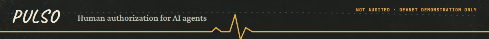

> **NOT AUDITED · DEVNET DEMONSTRATION ONLY.** Prototype architecture, not production custody.
> Published spec — see the [README](../README.md) for context.

# PULSO × Solana — On-chain Architecture

## Overview

```text
Human
  ↓ wallet signature
PULSO App
  ↓ exact approval
Solana
  ├── Policy PDA
  ├── Intent PDA
  └── PULSO Program
          ↓ allow/reject
       AI Agent
          ↓
    USDC / SPL / Programs
```

For the current account fields, checks, events, and error codes, see [Policy and Intent Specification](POLICY_AND_INTENT_SPEC.md), which documents the reference implementation. The account sketches below are conceptual; they are not a substitute for that specification.

## AgentPolicy PDA

Conceptual seeds:

```text
["policy", human_pubkey, agent_pubkey]
```

Core fields:

```rust
pub struct AgentPolicy {
    pub human: Pubkey,
    pub agent: Pubkey,
    pub enabled: bool,
    pub max_per_transaction: u64,
    pub daily_limit: u64,
    pub require_approval_for_new_recipient: bool,
    pub require_approval_above: u64,
    pub policy_version: u32,
    pub bump: u8,
}
```

The current implementation also stores the daily-window counter and start time, and a permanent agent-revocation flag.

## IntentAuthorization PDA

Current seeds:

```text
["intent", authority, action_hash]
```

```rust
pub struct IntentAuthorization {
    pub authority: Pubkey,
    pub agent: Pubkey,
    pub action_hash: [u8; 32],
    pub issued_at: i64,
    pub expires_at: i64,
    pub max_uses: u16,
    pub used_count: u16,
    pub revoked: bool,
    pub bump: u8,
}
```

The current implementation also has a `RecipientApproval` PDA for a human-approved destination token account.

## Action hash

The canonical hash binds the version, chain, program, instruction, authority, agent, mint, amount, recipient, `max_uses`, nonce, and expiration. It uses a fixed 216-byte preimage; the exact order and encoding are defined in the [Policy and Intent Specification](POLICY_AND_INTENT_SPEC.md).

## Lifecycle

An action within the policy can execute automatically. An action above an approval threshold or to a new recipient that requires approval needs a human-signed intent.

After human approval, the agent repeats exactly the same action. The program checks policy status, limits, hash, validity, and use count before allowing the transfer.

## Enforcement in the MVP

For the hackathon, the most demonstrable path is a **program-controlled demo vault** on devnet. This provides real on-chain enforcement and prevents the agent from simply ignoring the backend.

The demo must state clearly: **prototype architecture ≠ audited production custody**.

## Privacy

Do not put names, CPF numbers, postal addresses, prompts, or personal history on-chain. Store public keys, hashes, limits, timestamps, and status.

## Framework

For speed: **Anchor + Rust**.
